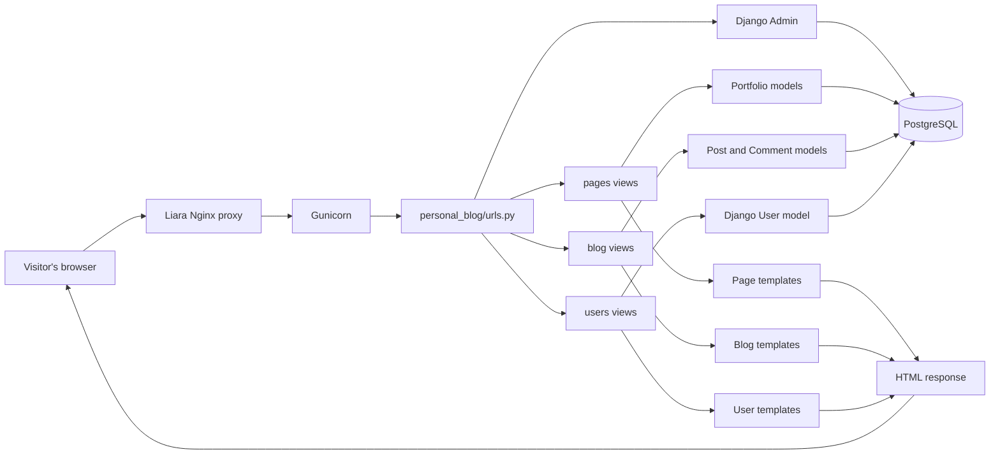
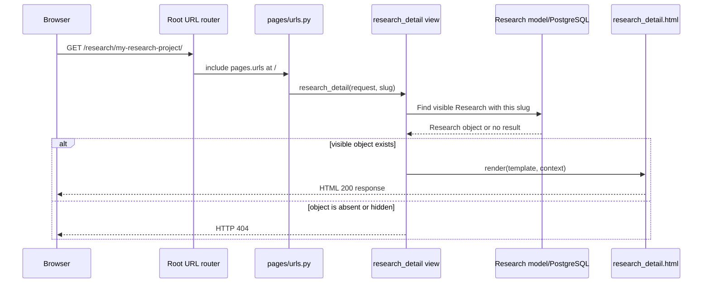
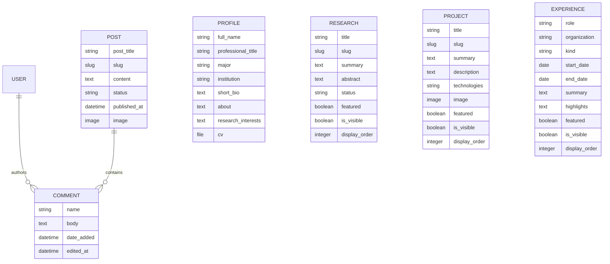
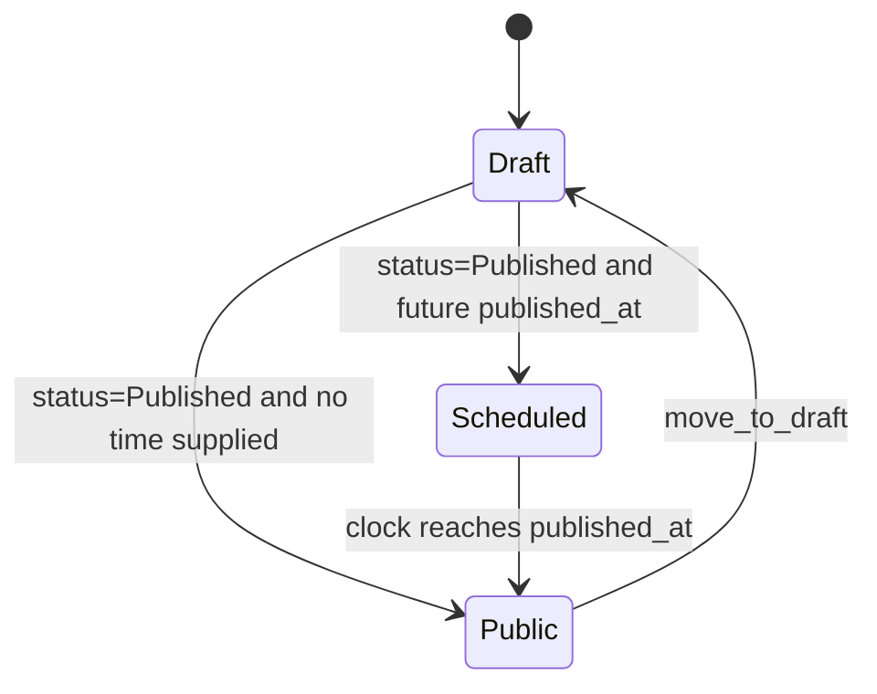
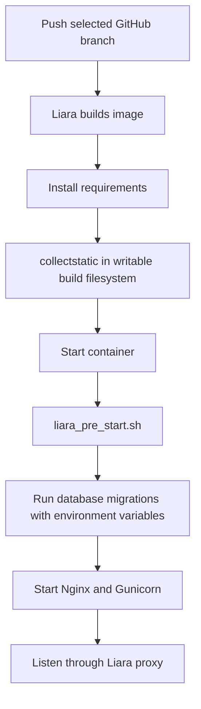

# Personal Blog and Academic Portfolio: Design and Code Guide

Last reviewed: September 10, 2026  
Current code snapshot: `feature/academic-navigation`, including the Experience and contact work in the working tree

This document explains how the project is organized, how a browser request moves through Django, where data is stored, how the public website and admin panel relate to each other, how deployment works, and how to make changes safely.

The most useful way to read it is:

1. Read **The big picture** and **How one request moves through Django**.
2. Read the section for the feature you want to change.
3. Follow one of the recipes in **How to modify the project safely**.
4. Run the checks in **Testing and verification**.

---

## 1. What this project is

This is one Django project containing three application modules:

- `pages`: the academic portfolio—profile, research, projects, experience, CV, About, and Contact.
- `blog`: posts, publishing rules, public comments, and comment management.
- `users`: registration, email-based login, logout, and authentication tests.

Django's built-in applications provide the admin panel, authentication tables, sessions, messages, and static-file support.

The site has two different interfaces over the same database:

- The **public website** presents selected, visible content to visitors.
- **Django Admin** at `/admin/` lets a trusted administrator create and edit that content.

The admin panel is not a separate database or a separate application. It edits the same model objects that the public views read.

---

## 2. The big picture



The important layers are:

| Layer | Purpose | Main files |
|---|---|---|
| Project configuration | Connects all applications and configures Django | `personal_blog/settings.py`, `personal_blog/urls.py` |
| URL routing | Maps a URL to a Python view | `pages/urls.py`, `blog/urls.py`, `personal_blog/urls.py` |
| Models | Describe data and business rules | `pages/models.py`, `blog/models.py` |
| Views | Process requests and choose responses | `pages/views.py`, `blog/views.py`, `users/views.py` |
| Forms | Validate submitted user data | `blog/forms.py`, `users/forms.py` |
| Templates | Turn context data into HTML | `templates/base.html`, application `templates/` directories |
| Static files | CSS and repository-owned images | `pages/static/`, `users/static/` |
| Admin configuration | Controls the private content-management UI | `pages/admin.py`, `blog/admin.py` |
| Tests | Specify and verify expected behavior | `pages/tests.py`, `blog/tests.py`, `users/tests.py` |
| Deployment | Builds and starts the application | `liara.json`, `liara_pre_start.sh`, `start.sh`, `build.sh` |

---

## 3. Repository map

```text
personal-blog/
├── manage.py                     # Entry point for Django management commands
├── personal_blog/                # Project-wide configuration
│   ├── settings.py               # Apps, database, templates, files, security
│   ├── urls.py                   # Root URL router
│   ├── wsgi.py                   # Production WSGI application used by Gunicorn
│   └── asgi.py                   # ASGI entry point, currently not used by Gunicorn
├── pages/                        # Academic portfolio application
│   ├── models.py                 # Profile, Research, Project, Experience
│   ├── views.py                  # Portfolio page request handlers
│   ├── urls.py                   # Portfolio routes
│   ├── context_processors.py     # Makes site_profile available to all templates
│   ├── admin.py                  # Portfolio admin panels
│   ├── migrations/               # Portfolio database schema history
│   ├── templates/pages/          # Portfolio HTML templates
│   └── static/                   # CSS, repository-owned images, bundled public CV
├── blog/                         # Writing and comments application
│   ├── models.py                 # Post, PostQuerySet, Comment
│   ├── views.py                  # Post listing/detail and comment actions
│   ├── forms.py                  # CommentForm
│   ├── urls.py                   # Blog and comment routes
│   ├── admin.py                  # Post workflow and comment admin
│   ├── migrations/               # Blog schema history
│   └── templates/blog/           # Blog HTML templates
├── users/                        # Authentication application
│   ├── forms.py                  # Registration and email-shaped login form
│   ├── backends.py               # EmailBackend
│   ├── views.py                  # Registration, Login, Logout
│   ├── tests.py                  # Authentication behavior
│   └── templates/users/          # Authentication pages
├── templates/base.html           # Shared header, navigation, messages, footer
├── requirements.txt              # Locked Python dependencies
├── .env.example                  # Safe environment-variable template
├── liara.json                    # Liara Django build configuration
├── liara_pre_start.sh            # Runtime migration hook
├── build.sh                      # Generic non-Liara build script
├── start.sh                      # Generic Gunicorn start script
├── Procfile                      # Points compatible hosts to start.sh
└── CONTRIBUTING.md               # Branch-naming contract
```

Files under `.venv/`, `staticfiles/`, and local database or media directories are generated or environment-specific. They are not source code.

---

## 4. How one request moves through Django

Consider a visitor opening:

```text
https://example.com/research/my-research-project/
```

The flow is:



In code, this division of responsibility is deliberate:

- The **URL pattern** extracts `slug` from the address.
- The **view** decides which objects a visitor may access.
- The **model** describes the object's fields and behavior.
- The **template** controls presentation.

When changing a feature, first decide which responsibility is changing. A color belongs in CSS; a visibility rule belongs in a queryset or view; a new stored value belongs in a model and migration.

---

## 5. URL routing

### 5.1 Root routing

`personal_blog/urls.py` is the first router Django uses.

| URL prefix | Destination |
|---|---|
| `/admin/` | Django Admin |
| `/` | `pages.urls` |
| `/blog/` | `blog.urls` |
| `/register/` | Registration view |
| `/login/` | Custom `Login` view |
| `/logout/` | Custom `Logout` view |
| `/users/` | `users.urls`, which is currently empty |

Removing Login and Sign up from the header only removes public navigation links. The `/login/` and `/register/` routes still exist if someone enters them directly. Disable or remove the registration route separately if public registration is no longer part of the product.

### 5.2 Portfolio routes

| URL | URL name | View | Template/response |
|---|---|---|---|
| `/` | `pages:home` | `HomePage` | `pages/home.html` |
| `/about/` | `pages:about` | `About` | `pages/about.html` |
| `/research/` | `pages:research` | `research` | `pages/research.html` |
| `/research/<slug>/` | `pages:research-detail` | `research_detail` | `pages/research_detail.html` |
| `/projects/` | `pages:projects` | `projects` | `pages/projects.html` |
| `/projects/<slug>/` | `pages:project-detail` | `project_detail` | `pages/project_detail.html` |
| `/experience/` | `pages:experience` | `experience` | `pages/experience.html` |
| `/cv/` | `pages:cv-download` | `download_cv` | Downloadable PDF response |
| `/contact/` | `pages:contact` | `Contact` | `pages/contact.html` |

### 5.3 Blog routes

| URL | URL name | Behavior |
|---|---|---|
| `/blog/posts/` | `blog:posts` | Lists public posts |
| `/blog/posts/<integer>/` | `blog:legacy-detail` | Redirects an old numeric URL to the slug URL |
| `/blog/posts/<slug>/` | `blog:detail` | Shows a public post and accepts new comments |
| `/blog/comments/<id>/edit/` | `blog:comment-edit` | Lets an authenticated author edit their comment |
| `/blog/comments/<id>/delete/` | `blog:comment-delete` | Deletes an authorized comment using POST only |

### 5.4 Why URL names and `reverse()` matter

Templates and Python code usually refer to a route by name instead of hardcoding its path:

```django

```

```python
reverse("admin:index")
```

`reverse("admin:index")` asks Django: “What URL currently belongs to the admin site's index page?” It currently returns `/admin/`. If the admin prefix later changes, named URL calls continue to work without updating every template and redirect.

---

## 6. Data model and database design



`Profile`, `Research`, `Project`, and `Experience` are logically independent portfolio content. `Post` owns many `Comment` objects. A comment may optionally point to a Django `User`.

### 6.1 Profile

`Profile` stores the site's identity and reusable personal information:

- name and an optional professional title field retained for future use;
- major, institution, and location;
- expected graduation and GPA facts;
- short homepage biography and longer About text;
- one research interest per line;
- honors, labeled technical-skill groups, languages, and service entries;
- personal note;
- email and professional profile URLs;
- an optional admin-uploaded replacement CV PDF.

`Profile.clean()` prevents a second profile from being created. The admin's `has_add_permission()` also removes the Add button after one exists. This is a singleton convention enforced at application level, not a database-level singleton constraint.

The `interest_list` property converts a multiline text field into a clean Python list. Templates can then loop over it without parsing strings themselves.

### 6.2 Research

`Research` represents a research direction, study, paper, or ongoing investigation.

Important fields:

- `summary`: short card copy;
- `abstract`: longer detail-page copy;
- `status`: ongoing, preprint, or published;
- `venue`, `year`, and `collaborators`: academic context;
- `publication_url` and `code_url`: external outcomes;
- `featured`: preference for homepage selection;
- `is_visible`: public/private switch;
- `display_order`: manual ordering priority.

If `slug` is blank, `save()` calls `unique_slug()`. Duplicate titles receive `-2`, `-3`, and so on. Existing slugs stay stable when titles change, protecting shared links.

### 6.3 Project

`Project` follows the same visibility, feature, order, and slug patterns as `Research`. It additionally stores:

- a longer problem/approach/outcome description;
- a human-readable project date or date range;
- comma-separated technologies;
- an optional screenshot;
- repository and live-project URLs.

The `technology_list` property turns the comma-separated string into a list for template tags. Project dates are intentionally stored as display text because CV project timing may be a month, season, or range rather than one exact database date.

### 6.4 Experience

`Experience` is designed for research roles, internships, teaching/TA work, and professional roles.

It stores role, organization, category, location, exact dates, an optional human-readable date label, summary, line-separated achievements, organization link, homepage feature state, visibility, and display order. The date label supports honest but non-exact CV periods such as `Summer 2026 - Present`; the template uses exact dates when no label is supplied.

`clean()` rejects an end date earlier than the start date. `highlight_list` converts line-separated achievements into list items.

Use the summary for one concise overview. Use highlights for concrete evidence such as a tool built, experiment completed, performance improvement, report presented, or students supported.

### 6.5 Post and PostQuerySet

Posts have Draft and Published states. A Published row is public only when `published_at` is not in the future.

`PostQuerySet.published()` centralizes that rule:

```text
status is Published AND published_at <= current time
```

Both the post list and non-staff detail lookup use this queryset. Centralizing it reduces the chance that one view accidentally exposes drafts.

`Post.save()` enforces three behaviors:

1. Generate a unique slug when it is missing.
2. Set `published_at` to now when publishing immediately.
3. Clear `published_at` when moving back to Draft.

The admin's bulk actions use `queryset.update()`, which bypasses `save()`. They explicitly update both status and time so they preserve the same invariant.

### 6.6 Comment

Each comment belongs to one post. `on_delete=models.CASCADE` means deleting a post deletes its comments.

`author` is optional:

- Authenticated comment: stores the User relation and a display-name snapshot.
- Guest comment: has no User relation and stores the submitted name or `Anonymous`.

`on_delete=models.SET_NULL` on the author means deleting a user does not delete their past comments.

### 6.7 Migrations

Changing a model class does not directly change PostgreSQL. A migration records the schema change:

```bash
python manage.py makemigrations
python manage.py migrate
```

Think of migrations as version control for the database structure. Commit migration files with the model change that generated them. Do not delete or rewrite migrations that production has already applied unless you fully understand the database consequences.

The current portfolio migration also updates the singleton Profile and creates the initial Research, Project, and Experience records from the CV. It seeds structured education facts, awards, skills, languages, service, project dates, contact details, and the public academic biography. It uses stable lookup keys (`slug`, or role plus organization) so the data operation is repeatable. After migration, all of that content remains ordinary database data and can be edited through Admin.

---

## 7. Portfolio application flows

### 7.1 Homepage selection

`HomePage` builds three visible querysets: Research, Project, and Experience. For each type:

1. Start with `is_visible=True`.
2. Prefer up to two `featured=True` objects when any exist.
3. Otherwise show the first two visible objects according to model ordering.

The view passes those objects and the Profile into `pages/home.html`.

The homepage order is:

1. compact academic introduction with name, degree, institution, biography, and two primary actions;
2. selected research;
3. featured projects;
4. selected experience, only when visible experience exists;
5. optional personal note.

The professional title, research-interest tags, extra CV action, and contact callout are intentionally omitted from the homepage. The navigation already exposes CV and Contact, while the About page contains the full research-interest list. This keeps the homepage focused and avoids repeating the same information.

Writing remains implemented under `/blog/posts/`, but it is intentionally absent from the public header and homepage until there are polished posts.

### 7.2 Visibility versus deletion

Research, Project, and Experience use `is_visible`. Turning it off is preferable to deleting unfinished content:

- it disappears from public querysets;
- it remains editable in Admin;
- links return 404 instead of exposing the draft;
- it can be restored later.

`featured` does not make an object public. An object must still have `is_visible=True`.

### 7.3 CV download

`download_cv()` provides a stable `/cv/` URL with two sources:

1. It finds the singleton Profile and uses its admin-uploaded `cv` file when one exists.
2. Otherwise it uses the repository-owned `pages/static/documents/bahar-barghbani-cv.pdf` fallback.
3. It returns the selected PDF as a `FileResponse` with `Content-Disposition: attachment`.

The public CV navigation link can therefore remain visible from the first deployment. Uploading a newer PDF in Admin under **Academic profile → Curriculum vitae** overrides the bundled copy without a code deployment. If no uploaded or bundled PDF exists, the view still returns 404 rather than failing unexpectedly.

### 7.4 Direct contact page

The Contact page is intentionally read-only. Its view is protected by `@require_GET`, so a crafted POST request receives `405 Method Not Allowed` rather than being processed. No form, SMTP credentials, email backend, or contact-submission storage is involved.

The public contact panel and footer read email, GitHub, LinkedIn, Scholar, and ORCID from Profile via `site_profile`. The email link uses `mailto:`, which asks the visitor's device to open its configured email application.

---

## 8. Blog and comment flows

### 8.1 Publishing workflow



Staff can preview any Post because `post_detail()` uses all posts for staff users. Visitors use only `Post.objects.published()`.

The numeric legacy detail route permanently redirects to the slug route, preserving older links while presenting readable URLs.

### 8.2 Adding a comment

`post_detail()` handles both GET and POST:

- GET creates an empty `CommentForm` and renders comments.
- POST validates the same form, attaches the post, determines author/name, saves, adds a success message, and redirects back to the post.

The redirect is the **POST/Redirect/GET pattern**. It prevents browser refresh from submitting the same comment twice.

Comments are published immediately. There is no pending or approval state.

### 8.3 Editing and deleting

- Editing requires login and looks up a comment whose `author` is the current user.
- A failed ownership check returns 404, which avoids confirming that another user's comment exists.
- Deletion requires login and POST.
- Regular users can delete their own comments.
- Staff can delete any comment.
- Anonymous comments have no owner and can therefore be removed only by staff through the public action or Admin.

CSRF tokens protect all POST forms.

---

## 9. Authentication design

The project currently uses Django's built-in `User`, not a custom user model.

`LoginForm` replaces the visible username input with an Email field. `EmailBackend.authenticate()` performs a case-insensitive lookup by email and verifies the password.

Authentication backends run in order:

1. `users.backends.EmailBackend`;
2. Django's standard `ModelBackend`.

After login:

- staff users go to Django Admin;
- non-staff users go to the homepage;
- a safe `next` destination takes precedence when login was required by another view.

The public header no longer advertises Login or Sign up. Authenticated users still see Logout, and staff see Admin/New post tools.

Important limitation: the registration form checks email uniqueness, but the User table does not enforce unique email at database level. Admin or scripts could create duplicates, and `User.objects.get(email__iexact=...)` would then raise `MultipleObjectsReturned`. If visitor accounts are permanently unnecessary, disabling public registration is cleaner than expanding this authentication system.

---

## 10. Template structure

All main templates extend `templates/base.html`:

```django

```

The base template owns:

- metadata and CSS imports;
- public brand and navigation;
- authenticated staff controls;
- flash messages;
- the main content slot;
- footer contact links.

Child templates replace named blocks:

```django
...
...
...
```

This means a navigation change belongs in one file—`templates/base.html`—rather than every page.

### 10.1 Context processors

`pages.context_processors.academic_profile` fetches the first Profile and returns it as `site_profile`. Because it is registered in `TEMPLATES`, every request rendered with Django templates can use:

```django
{{ site_profile.full_name }}
```

Page-specific views may also pass the same object as `profile`. `site_profile` is intended for shared header/footer data; `profile` is used in page content.

### 10.2 Template safety

Django escapes variable output by default. User-entered text such as comment bodies is not interpreted as arbitrary HTML. Filters such as `linebreaks` and `linebreaksbr` format plain text while retaining Django's escaping behavior.

---

## 11. CSS and visual design

The site currently loads two portfolio stylesheets in this order:

1. `pages/static/pages/style.css`—older base, blog, form, and comment rules.
2. `pages/static/pages/academic.css`—the newer academic design and overrides.

When selectors have equal specificity, the later stylesheet wins. This is useful during a redesign, but it also means apparently duplicated rules can be confusing. A future refactor should consolidate these files.

### 11.1 Design tokens

`academic.css` defines colors, fonts, shadows, and line colors in `:root`:

```css
:root {
  --ink: #182a2d;
  --paper: #fbfaf6;
  --academic-blue: #173f4f;
  --academic-teal: #1f716f;
  --serif: "Source Serif 4", Georgia, serif;
  --sans: "Inter", sans-serif;
}
```

Changing a token updates many components consistently. Use tokens for brand-level changes; use a component selector for a local adjustment.

### 11.2 Portrait source, circular frame, and crop

The shared header uses the repository-owned file:

```text
pages/static/images/laptop-me.jpg
```

It does not use an admin-uploaded Profile image. The portrait appears once, inside the Home link at the left of the navigation header, so pages do not repeat a large portrait.

The circular frame size is controlled by `.site-avatar`:

```css
.site-avatar {
  width: 64px;
  height: 64px;
  border-radius: 50%;
  overflow: hidden;
}
```

Change `width`, `height`, and `flex-basis` together to resize it. A smaller mobile size is defined under `@media (max-width: 480px)`.

Cropping is controlled by:

```css
height: 220%;
top: 50%;
left: 50%;
transform: translate(-44%, -37%);
```

- `height` controls zoom; increase `220%` for a tighter face crop.
- `top` and `left` place the image's anchor at the center of the circular frame.
- The two negative `translate` percentages identify the face's approximate horizontal and vertical position inside the original photograph.
- Increase the magnitude of the first percentage when the face is farther right in the source image; increase the magnitude of the second when it is farther down.

### 11.3 Responsive layout

Media queries near the end of `academic.css` change grid layouts at smaller widths. Before changing a desktop width, search for the same selector inside media queries. Otherwise a mobile override may appear to “undo” your change.

---

## 12. Static files versus uploaded media

This distinction is essential.

| Type | Examples | Ownership | Lifecycle |
|---|---|---|---|
| Static | CSS, `laptop-me.jpg`, bundled fallback CV | Git repository | Collected during build; versioned with code |
| Media | Replacement CV, post images, project images | Administrator uploads | Must live on persistent disk/object storage |

`collectstatic` copies static assets into `STATIC_ROOT` (`staticfiles/`). WhiteNoise uses `CompressedManifestStaticFilesStorage` to compress them and give changed assets versioned names.

Media uses `MEDIA_ROOT`. In the current Liara configuration, a persistent disk named `media` is mounted at `media/`, and a relative `MEDIA_ROOT=media` resolves below the project base directory.

Production currently serves media through Django when `SERVE_MEDIA=True`. That is acceptable for a small portfolio, but object storage or dedicated media serving is a better long-term design for higher traffic or multiple application instances.

---

## 13. Django Admin design

Django Admin discovers registered model classes when applications start.

### Portfolio admin

- **Academic profile** groups identity, education and GPA facts, About content, awards, skills, languages, service, contact links, and CV.
- **Research** provides status filters, search, visibility, feature state, and manual ordering.
- **Project** provides technologies, image, repository/live URLs, visibility, and ordering.
- **Experience** provides category/date filters, a flexible display-date label, summaries, achievements, visibility, and ordering.

`list_editable` lets an administrator change feature, visibility, and ordering directly from list pages.

### Blog admin

- Post fields are separated into Content and Publication sections.
- `publish_now` and `move_to_draft` are bulk actions.
- Comment dates are read-only; comments can be searched by author, text, and post.

Two admin modules currently assign global admin titles. Since application import order determines the final assignment, that configuration should eventually live in one project-level place.

---

## 14. Settings and environment variables

`.env.example` documents variable names but contains no real secrets. Local `.env` is ignored by Git.

`django-environ` reads local `.env`, then settings use typed accessors:

```python
DEBUG = env.bool("DEBUG", default=True)
ALLOWED_HOSTS = env.list("ALLOWED_HOSTS", default=[...])
```

Production should provide variables through Liara, not a committed `.env`.

### Database selection

The settings choose one of three database configurations:

1. Use `DATABASE_URL` when present—production's preferred path.
2. During Liara's environment-free `collectstatic` build command, use in-memory SQLite because static collection does not require application data.
3. Otherwise build a local PostgreSQL configuration from `DB_NAME`, `DB_USER`, `DB_PASSWORD`, `DB_HOST`, and `DB_PORT`.

### Build-only settings

Liara does not expose application environment variables while it runs build-time `collectstatic`. `COLLECTING_STATIC` detects only that command and permits a non-production build key plus an in-memory database.

At normal application startup, the real `SECRET_KEY` remains mandatory. The fallback therefore solves build mechanics without silently running the website with an insecure key.

### Security settings

Production values should include:

```env
DEBUG=False
SECURE_SSL_REDIRECT=True
SESSION_COOKIE_SECURE=True
CSRF_COOKIE_SECURE=True
```

Keep `SECURE_HSTS_SECONDS=0` until the final HTTPS domain is fully verified. HSTS is remembered by browsers and should be enabled deliberately.

Never commit or display production `SECRET_KEY`, database credentials, or email app passwords. Rotate a value immediately if it appears in a screenshot, Git history, support message, or public log.

---

## 15. Liara deployment lifecycle



### Build phase

`liara.json` selects Django, Python 3.12, timezone, static collection, and disk configuration. Static files must be collected here because the application directory is writable during the image build.

### Pre-start phase

`liara_pre_start.sh` runs `migrate`. Liara environment variables and PostgreSQL are available in this phase. The application filesystem is read-only, so do not write `staticfiles/` here.

### Runtime

Gunicorn loads `personal_blog.wsgi:application`. A generic deployment through `start.sh` binds to:

```text
0.0.0.0:${PORT}
```

`0.0.0.0` exposes the process to the container network. `127.0.0.1` would expose it only inside the application process's own network namespace and can cause a proxy 502.

### Why a deployment can succeed but the page can still fail

“Deployment succeeded” can mean the image built successfully. A later pre-start or runtime error can still create a restart loop. Always inspect runtime logs after the build log.

---

## 16. How to modify the project safely

### 16.1 Content-only changes through Admin

No code change is required to:

- update biography, major, institution, contact links, interests, or personal note;
- upload a newer CV to override the bundled copy;
- add/reorder/hide Research, Projects, or Experience;
- create drafts, schedule posts, and publish posts;
- review or delete comments.

Use code only when the structure or behavior needs to change.

### 16.2 Change navigation

Edit `templates/base.html` inside `<nav class="primary-nav">`.

Prefer named URLs:

```django
<a href="">Experience</a>
```

Then add a test that checks the link, label, and order. Do not remove a route merely because its public link is hidden unless the feature should truly become inaccessible.

### 16.3 Add a new portfolio page

Use this sequence:

1. Decide whether the page needs stored data.
2. Add or modify a model when data is required.
3. Run `makemigrations`.
4. Register the model in Admin.
5. Add a view that fetches only public objects.
6. Add a named URL.
7. Add a template extending `base.html`.
8. Add component CSS.
9. Add tests for success, visibility, and permissions.
10. Run migrations/checks/tests locally.

Experience follows exactly this pattern and is a useful reference implementation.

### 16.4 Add a field to a model

Example: adding `advisor` to Research.

```python
advisor = models.CharField(max_length=180, blank=True)
```

Then:

```bash
python manage.py makemigrations pages
python manage.py migrate
```

Update Admin, templates, and tests. For an existing production table, decide whether the new field can be blank or needs a safe default.

### 16.5 Change homepage ordering

Section order is HTML order in `pages/templates/pages/home.html`. Move complete `<section>` blocks rather than individual closing tags.

Object order inside Research, Project, and Experience comes from model `Meta.ordering`, beginning with `display_order`. Lower display-order numbers appear first.

### 16.6 Change the portrait

Replace `pages/static/images/laptop-me.jpg` while keeping the filename, or update its path in `templates/base.html`.

Change `.site-avatar` and `.site-avatar img` in `academic.css`, then inspect desktop and mobile. Image pixel dimensions affect download size; CSS dimensions affect displayed size.

### 16.7 Change contact information

Edit email and professional profile URLs through **Admin → Academic profile**. The Contact page and footer both receive the same `site_profile` object, so one Admin edit updates both locations. Layout and explanatory text live in `pages/templates/pages/contact.html` and its CSS. Reintroducing a server-side contact form would require a deliberate form, delivery provider, abuse protection, failure behavior, and tests rather than only adding HTML fields.

### 16.8 Change comment permissions

Permission checks belong in `blog/views.py`, not only in templates. Hiding an Edit button does not stop a crafted HTTP request.

When changing permissions, test at least:

- guest;
- comment author;
- another authenticated user;
- staff user;
- GET versus POST for destructive operations.

### 16.9 Change publishing rules

Keep the public rule centralized in `PostQuerySet.published()`. If you add states such as Archived, update:

- model choices;
- queryset rule;
- `save()` invariants;
- admin filters/actions;
- staff preview wording;
- tests for list and detail access.

---

## 17. Testing and verification

### Quick configuration checks

```bash
python manage.py check
python manage.py makemigrations --check
```

The second command catches a model edit whose migration was forgotten.

### Full tests

```bash
python manage.py test
```

The local PostgreSQL user must be able to create a temporary test database. When that permission is unavailable, this project can run its current test suite against isolated SQLite:

```bash
DATABASE_URL=sqlite:///:memory: python manage.py test
```

### Deployment-related checks

```bash
python -m json.tool liara.json
bash -n liara_pre_start.sh
python manage.py collectstatic --no-input
```

### What the tests currently cover

- direct contact links, absence of a contact form, and rejection of POST submissions;
- CV-derived profile/content seeding, portfolio visibility, homepage feature selection, slugs, CV download, Admin access;
- academic navigation order and hidden public account links;
- Experience page visibility and contact profile links;
- guest/authenticated commenting;
- comment ownership and staff deletion;
- CSRF protection and POST-only deletion;
- draft, scheduled, published, and staff-preview post behavior;
- email login, staff redirect, logout, and staff navigation.

Tests prove specified behavior, not visual quality. After template/CSS changes, inspect at least a desktop width and a narrow mobile width.

---

## 18. Git workflow

The branch contract is:

```text
<type>/<short-kebab-case-purpose>
```

Allowed types are `feature`, `fix`, `refactor`, `test`, `docs`, and `chore`.

Examples:

```text
feature/academic-navigation
fix/liara-build-environment
docs/project-design-guide
```

A normal change flow is:

```bash
git switch main
git pull --ff-only
git switch -c feature/short-purpose

# edit, migrate if needed, and test

git add <specific-files>
git commit -m "feat: describe the outcome"
git push -u origin feature/short-purpose
```

Keep generated files, local `.env`, uploaded media, and unrelated edits out of the commit. Merge a tested branch into `main`; Liara should normally deploy `main` after promotion.

---

## 19. Debugging guide

### `SECRET_KEY` exists in Liara but build says it is missing

Determine which phase produced the error. Liara build-time `collectstatic` cannot see application variables. The build-only settings path exists specifically for this case. Do not commit `.env` and do not add a runtime secret fallback.

### `Read-only file system: /usr/src/app/staticfiles`

Static collection is running too late in pre-start/runtime. Enable Liara build-time collection and keep pre-start focused on migrations.

### 502 after a successful build

Read runtime logs. Common causes are:

- pre-start script exits nonzero;
- Gunicorn crashes while importing settings;
- wrong port/bind address;
- database connection failure;
- repeated container restart.

### Port already in use locally

Find the process:

```bash
lsof -nP -iTCP:8000 -sTCP:LISTEN
```

Stop the exact process or run another port:

```bash
python manage.py runserver 8001
```

If killing one PID does not free the port, Django's autoreloader may have a parent and child process. Run `lsof` again instead of repeatedly killing the old PID.

### Uploaded image or CV disappears

Confirm `MEDIA_ROOT` points to the mounted persistent disk, not the read-only application image or temporary container filesystem. Static collection does not preserve uploaded media.

### A route raises `NoReverseMatch`

Check the namespace, name, and required arguments in the relevant `urls.py`. For example, a research detail URL requires a slug, while `pages:research` does not.

### Migration says a relation or index already exists

Do not delete migrations or reset the production database immediately. Compare Django's migration table with the actual PostgreSQL schema and determine whether a migration was partially applied. Back up production data before any schema repair.

---

## 20. Current limitations and recommended next improvements

These are not all urgent, but they are useful architectural context.

1. **Portrait management:** the portrait is hardcoded static content. Add an optional Profile `ImageField` if you want to replace it through Admin.
2. **Registration exposure:** Login/Sign up links are hidden, but `/register/` remains public. Disable registration if visitor accounts are no longer required.
3. **Spam protection:** comments still accept public submissions. Add throttling, honeypot protection, or a privacy-respecting CAPTCHA before meaningful traffic.
4. **Media serving:** Django's development-style media response is simple but not ideal at scale. Move uploads to object storage when needed.
5. **Unique email guarantee:** enforce a reliable unique-email design before expanding user accounts.
6. **CSS consolidation:** merge old `style.css` rules with `academic.css` after the visual design stabilizes.
7. **Naming consistency:** view functions such as `HomePage` and `Contact` work, but lowercase snake_case would match normal Python conventions.
8. **Admin branding:** configure global admin titles once instead of in both `pages/admin.py` and `blog/admin.py`.
9. **Documentation drift:** deployment instructions must match the actual Liara disk mount and build lifecycle whenever those settings change.
10. **Observability:** add structured error monitoring before relying on comments for important communication.
11. **Content maintenance:** keep outcomes and dates current through Admin, replace the bundled CV when it changes, and add Scholar/ORCID only when those profiles are useful.

---

## 21. A practical learning path through this codebase

Use small experiments rather than trying to memorize every file.

### Exercise 1: trace a read-only page

Follow `/projects/` from root URLs to `pages/urls.py`, then `projects()`, `Project.objects.filter()`, and `projects.html`. Change one heading and add a test assertion.

### Exercise 2: add content through Admin

Create a hidden Experience, verify it is absent publicly, turn visibility on, mark it featured, and change `display_order`. Observe how the same row moves through the UI without code edits.

### Exercise 3: trace a form

Submit an invalid blog comment. Follow `request.POST` into `CommentForm`, field errors back into the post-detail template, and the valid branch into the new Comment row.

### Exercise 4: trace permissions

Read `delete_comment()` and its tests. Identify why authentication, ownership filtering, POST restriction, and CSRF are separate protections.

### Exercise 5: make a schema change

Add a harmless optional Experience field on a practice branch, generate a migration, expose it in Admin and the template, and write one test. Review the migration before applying it.

### Exercise 6: trace deployment

Start at `liara.json`, follow build-time static collection, then `liara_pre_start.sh`, settings import, migrations, WSGI, Gunicorn, and the proxy port. Compare build logs with runtime logs.

If you can explain each of these six paths in your own words, you understand the project's main architecture well enough to modify it confidently.
